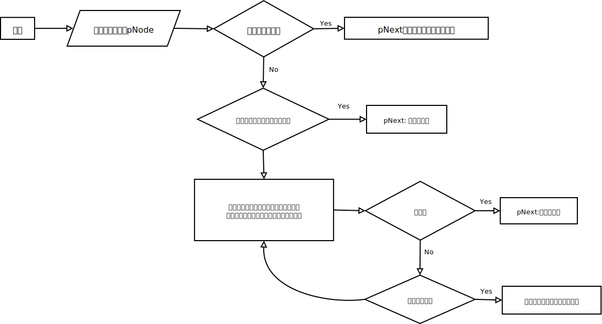

# 数据结构

主要考察以下几种数据结构：
+ 数组
+ 字符串
+ 链表
+ 树
+ 栈
+ 队列

其中，数组和字符是两种最基本的数据结构，它们用**连续内存**分别存储数字和字符；链表和指针是面试中出现**频率最高**的数据结构；栈是一种**与递归紧密相关**的数据结构；队列**与广度优先遍历算法**紧密相关。

## 数组

+ 连续内存、按照顺序存储数据
+ 空间效率不好。因为创建数组时，需要指定数组的大小，即使你只存了一个数据，也需要为所有的数据分配空间。
+ 时间效率很高。因为是连续内存存储，因此可以通过下标在O(1)时间读/写任何元素#

### 利用数组实现简单的哈希表

把数组的下标设为哈希表的键值Key，而把数组的每一个数字设为哈希表的值Value，这样每一个下标及数组中该下标对应的数字就组成了一个“键值——值”的配对。

### 动态数组

解决数组空间效率不高的问题，如C++的STL中的vector。先为数组开辟较小的空间，然后向里面添加数据，当数据的数量超过了数组的容量时，就再开辟一块更大的空间（STL中的vectro每次扩容，新的容量是原容量的两倍），然后把原来的数据复制到新创建的空间，再将原来的内存释放。

但是每次扩充数组容量时都有大量的额外操作，这样会影响性能，因此使用动态数组时尽量减少改变数组容量大小的次数。

### 数组与指针

数组和指针既有关联又相互区别

+ 数组名是一个指针，指向数组的第一个元素
+ C/C++没有记录数组的大小，因此在使用指针访问数组元素值，要注意不要超过数组的范围

```c++
int GetSize(int data[])
{
    return sizeof(data);
}

int main()
{
    int data1[] = {1,2,3,4,5};
    // 求数组的大小，20
    int size1 = sizeof(data1);
    
    int* data2 = data1;
    // 求指针的大小，4
    int size2 = sizeof(data2);
    
    // 当数组作为函数的参数传递时，数组就自动退化为同类型的指针
    int size3 = GetSize(data1);
    
    printf("%d, %d, %d", size1, size2, size3);
}
```

## 字符串

C/C++中每个字符串都以字符`\0`作为结尾，这样能很方便地找到字符串的最后尾部。每个字符串中都有一个额外字符的开销，稍不留神就会造成字符串的越界。

C/C++会把`常量字符串`放到单独的一个内存区域。

**解决字符串的问题首先要考虑在哪里处理**，是在原字符串上直接进行处理，还是创建新的字符串进行处理。

## 链表

+ 链表是一种动态数据结构，在创建链表时，无需知道链表的长度
+ 当插入一个节点时，只需为新节点分配内存，然后调整指针的指向来确保新节点被链接到链表当中
+ 内存分配不是在创建链表时完成的，而是每添加一个节点分配一次内存
+ 由于没有闲置的内存，链表的空间效率比数组高

## 树

树是一种在实际编程中经常遇到的数据结构，它的逻辑很简单：

+ 除根节点之外每个节点只有一个父节点，根节点没有父节点；
+ 除叶节点之外所有节点都有一个或多个子节点，叶节点没有子节点；
+ 父节点和子节点之间用指针链接。

面试的时候提到的树，大部分是二叉树。所谓二叉树是树的一种特殊结构，在**二叉树中每个节点最多只能有两个子节点**。二叉树中最重要的操作莫过于遍历，即按照某一顺序访问树中的所有节点。通常树有如下几种遍历方式：

+ 前序遍历：先访问根节点，再访问左子节点，最后访问右子节点；
+ 中序遍历：先访问左子节点，再访问根节点，最后访问右子节点；
+ 后序遍历：先访问左子节点，再访问右子节点，最后访问根节点。

这三种遍历都有递归和循环两种不同的实现方式。

+ 宽度优先遍历：先访问树的第一层节点，再访问树的第二层节点......一直到访问到最下面一层节点。在同一层节点中，从左到右的顺序依次访问。

二叉树的特例：

+ 二叉搜索树
+ 堆
+ 红黑树

**二叉搜索树**：左子节点总是小于或等于根节点，而右子节点总是大于或等于根节点。可以平均在`O(logn)`的时间内根据数值在二叉搜索树中找到一个节点。

**堆**：堆分为最大堆和最小堆。在最大堆中根节点的值最大，在最小堆中根节点的值最小。有很多需要快速找到最大值或最小值的问题都可以用堆来解决。

**红黑树**：把树中的节点定为红、黑两种颜色，并通过规则确保从根节点到叶节点的最长路径的长度不超过最短路径的两倍。在C++的STL中，set、multiset、map、multimap等数据结构都是基于红黑树实现的。

二叉树中序遍历找下一个节点

